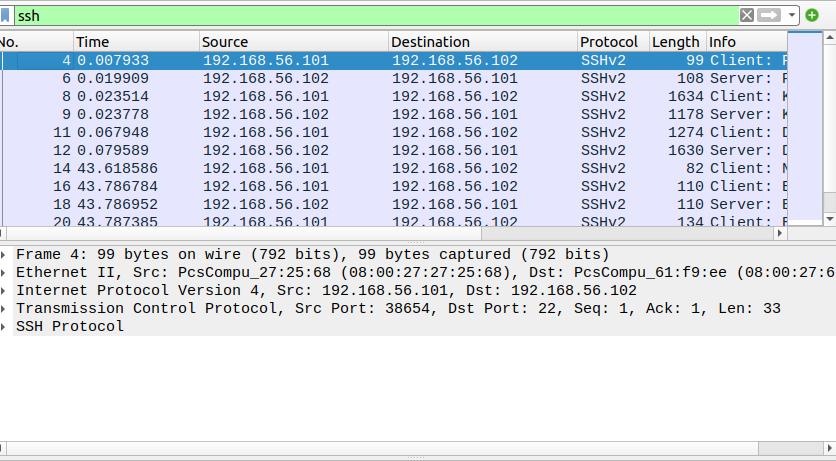

🔐 SSH Traffic Capture & Analysis Using tcpdump and Wireshark
A hands‑on cybersecurity lab demonstrating how SSH traffic behaves on the network, how the SSH handshake works, and why SSH sessions cannot be decrypted even with private keys. This project captures SSH traffic between Kali Linux and Ubuntu using tcpdump, analyzes the handshake in Wireshark, and documents the cryptographic properties that protect SSHv2.

📘 Table of Contents
- Project Introduction
- What You’ll Learn
- Architecture Diagram
- Tools Used
- Packet Capture with tcpdump
- SSH Traffic Analysis in Wireshark
- Why SSH Cannot Be Decrypted
- Screenshots
- Security Implications
- Conclusion & Key Takeaways
- Future Improvements

🚀 Project Introduction
Secure Shell (SSH) is one of the most widely used protocols for remote administration, file transfer, and secure communication. Understanding how SSH behaves at the packet level is essential for SOC analysts, blue teamers, and cybersecurity professionals.
This project captures and analyzes SSH traffic between a Kali Linux client and an Ubuntu server in a controlled VirtualBox homelab. Using tcpdump and Wireshark, the analysis focuses on:
- The SSHv2 handshake
- Key exchange negotiation
- Public key authentication
- Encrypted session behavior
- Why SSH traffic cannot be decrypted
This lab reinforces core concepts in encryption, confidentiality, and secure protocol design.

🎓 What You’ll Learn
- How SSHv2 negotiates encryption and authentication
- How to capture and analyze encrypted traffic
- How Diffie–Hellman provides Perfect Forward Secrecy
- How Wireshark displays encrypted SSH payloads
- How to build a controlled homelab for protocol analysis

🖧 Architecture Diagram
flowchart LR
    W[Windows Host Wireshark Analysis] -->|Host‑Only Network| K[Kali Linux tcpdump Capture]
    K <--> U[Ubuntu Server OpenSSH Server]



🛠️ Tools Used
- tcpdump – Packet capture on Kali
- Wireshark – Deep packet inspection
- OpenSSH – SSH server on Ubuntu
- VirtualBox – Virtualized lab environment

📡 Packet Capture with tcpdump
SSH traffic was captured on the Kali Linux client using:
sudo tcpdump -i eth0 -w ssh_capture.pcap port 22

This command captures all SSH packets on port 22 and writes them to a .pcap file for later analysis in Wireshark.

🔍 SSH Traffic Analysis in Wireshark
1. Protocol Negotiation (KEXINIT)
The client and server exchange supported algorithms, including:
- Key exchange algorithms
- Encryption ciphers
- MAC algorithms
- Compression methods

2. Diffie–Hellman Key Exchange
The client and server generate a shared secret using ephemeral keys, ensuring:
- Perfect Forward Secrecy
- Unique session keys for every connection
- Protection even if long‑term keys are compromised

3. Server Authentication
The server sends its public host key, which the client verifies to prevent MITM attacks.

4. Encrypted Session Begins
After the handshake completes, all traffic becomes encrypted.
Wireshark displays packets as:
Encrypted packet (len=xxx)

No payload or command content is visible.

## 📸 Screenshots

### SSH Handshake Packet in Wireshark

*Wireshark displaying the SSHv2 handshake, including algorithm negotiation and key exchange initialization.*

🛡️ Security Implications
- SSH traffic cannot be decrypted due to ephemeral key exchange
- MITM attacks are mitigated through host key verification
- Packet captures reveal metadata but not sensitive content
- For investigations, SSH logs are more valuable than packet payloads
- Encrypted protocols require analysts to focus on behavior, timing, and metadata

🏁 Conclusion & Key Takeaways
This project demonstrates a complete end‑to‑end analysis of SSH traffic in a controlled cybersecurity lab. By capturing packets with tcpdump and analyzing them in Wireshark, the lab highlights:
- How SSHv2 establishes a secure channel
- How key exchange algorithms are negotiated
- How public key authentication works
- Why SSH traffic becomes unreadable after the handshake
- Why SSH cannot be decrypted due to ephemeral Diffie–Hellman keys
This lab reinforces critical SOC analyst skills, including packet analysis, protocol understanding, encryption fundamentals, and documentation. It also provides a strong portfolio piece showcasing hands‑on cybersecurity experience.

🔧 Future Improvements
- Capture and analyze SSH brute‑force attempts
- Compare RSA vs ED25519 host keys
- Add Sysmon + Wazuh correlation for SSH login events
- Automate packet capture with a Bash script
- Include a sample .pcap file in the repository

